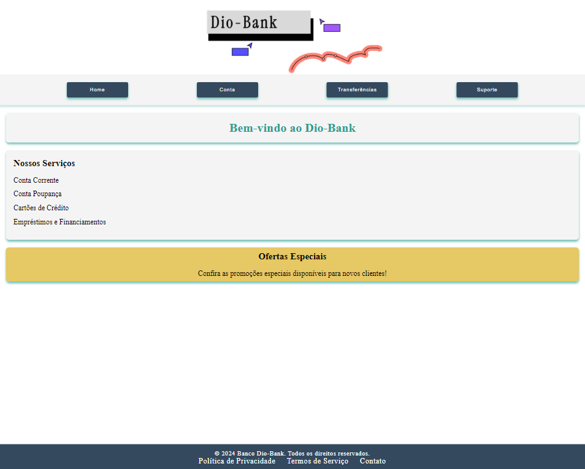

# DioBank - Sistema Bancário Simples

## 💻 Descrição do projeto

O DioBank é um sistema bancário simples que visa simular operações básicas de um banco digital, como login, consulta de saldo, dívida, crédito e reputação. As informações dos usuários são armazenadas localmente utilizando o `localStorage`. Este projeto foi desenvolvido em TypeScript com o React e foca em proporcionar uma experiência completa de navegação e interação com as funcionalidades de um banco virtual.

> **Colaboração:** Not found  
> **Status:**  Concluído ✔️

  
 👀 Prévia 

  

## 📜 Índice

- [Descrição](#-descrição-do-projeto)
- [Conceitos Aprendidos](#-conceitos-aprendidos)
- [Tecnologias Utilizadas](#-tecnologias-utilizadas)
- [Instalação](#-instalação)
- [Uso](#-uso)
- [Funcionalidades](#-funcionalidades)
- [Pendências](#-pendências)
- [Contribuição](#-contribuição)
- [Informações Adicionais](#-informações-adicionais)
- [Licença](#-licença)
- [Conclusão](#-conclusão)

## ✅ Conceitos Aprendidos 

- Armazenamento local com `localStorage`.
- Manipulação de estados globais com Context API no React.
- Integração de rotas com React Router.
- Implementação de componentes estilizados com Styled Components.
- Simulação de operações bancárias.

## 🛠 Tecnologias Utilizadas

## ⚙ Instalação

Para começar a usar este projeto, siga as etapas abaixo:

1. Faça um fork do repositório:
   <pre>git fork https://github.com/IgoRenatoo/TS-DIO-ProjectsCourseTypescript.git</pre>

2. Clone o seu fork para sua máquina:
   <pre>git clone https://github.com/IgoRenatoo/TS-DIO-ProjectsCourseTypescript.git</pre>

3. Acesse o diretório do projeto:
   <pre>cd TS-DIO-ProjectsCourseTypescript</pre>

4. Instale as dependências:
   <pre>npm install</pre>

## 🚀 Uso 

Para utilizar este projeto, siga as instruções abaixo:

1. Acesse a pasta 01-DioBank com o comando `cd 01-DioBank`.
2. Execute o comando `npm run dev` no terminal de sua preferência.
3. Utilize o navegador para acessar a aplicação.
   
   Endpoints disponíveis para operações:
   
   > `GET /home` - Página inicial com resumo das informações financeiras.

   > `GET /conta` - Exibe saldo, crédito, dívida e reputação.

   > `POST /transfer` - Realiza a transferência entre contas.

## 🧩 Funcionalidades

1. **GetAccount()**
   - Exibe os dados do usuário logado, incluindo saldo, dívida, crédito e reputação. Caso o usuário não esteja logado, oferece um botão para realizar o login.

2. **AuthenticateUser()**
   - Valida as credenciais do usuário (nome de usuário e senha) e armazena os dados do usuário no `localStorage` em caso de sucesso.

3. **GetHome()**
   - Apresenta uma mensagem de boas-vindas e uma lista de serviços disponíveis, como conta corrente, conta poupança, cartões de crédito e empréstimos.

4. **GetSupport()**
   - Permite que os usuários entrem em contato através de um formulário e disponibiliza uma seção de perguntas frequentes com informações úteis sobre a plataforma.

5. **GetTransfer()**
   - Permite que usuários logados realizem transferências para outros usuários, verificando se o saldo é suficiente antes de completar a operação.

## ⏳ Pendências

Atualmente, o código do projeto está completo em termos de funcionalidades básicas, incluindo autenticação de usuários, exibição de dados da conta, suporte ao cliente, e transferência de valores. No entanto, ainda falta a integração com o backend para garantir que as operações sejam persistentes e seguras.

### Pendência: Integração com o Backend
- **Descrição**: A integração com o backend é necessária para que as funcionalidades, como autenticação e transferência de valores, sejam realizadas de maneira segura e eficaz. Atualmente, o sistema armazena dados no `localStorage`, o que não é ideal para uma aplicação em produção.
  
- **Sugestões para Integração**:
  1. **API para Autenticação**: Criar um endpoint que valide as credenciais do usuário e retorne um token de autenticação, que pode ser armazenado no `localStorage`.
  2. **Endpoints para Dados do Usuário**: Implementar endpoints que forneçam dados do usuário, como saldo, dívida e crédito, que serão recuperados quando o usuário acessar a conta.
  3. **Persistência de Dados**: Implementar um banco de dados para armazenar as informações dos usuários, garantindo que os dados não se percam quando o navegador for fechado.

## 🤝 Contribuição 

Contribuições são bem-vindas! Se você deseja contribuir com este projeto, siga as etapas abaixo:

1. Faça um fork deste repositório.
2. Clone o seu fork para sua máquina (`git clone https://github.com/seu_usuário/DioBank.git`).
3. Crie uma branch para sua feature ou correção de bug (`git checkout -b nome-da-branch`).
4. Commit suas alterações (`git commit -m 'Mensagem desejada'`).
5. Push para a branch (`git push origin nome-da-branch`).
6. Abra um Pull Request.
7. Aguarde à análise.

## 💡 Informações adicionais

- O DioBank é um projeto de aprendizado, não indicado para uso real.
- Uso exclusivo para estudo de conceitos de desenvolvimento frontend com React e TypeScript.
- Não envolve integrações reais com sistemas bancários.

## 🔓 Licença

Este projeto está licenciado sob a Licença MIT.

## 🏁 Conclusão

O projeto DioBank permitiu explorar conceitos de armazenamento local, gerenciamento de estado com React e implementações de rotas dinâmicas, proporcionando uma boa experiência em criar um sistema bancário simulado.

😎 Programação é resolver problemas que você não sabia que tinha, de maneiras que você não entende! 

